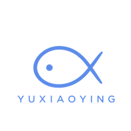
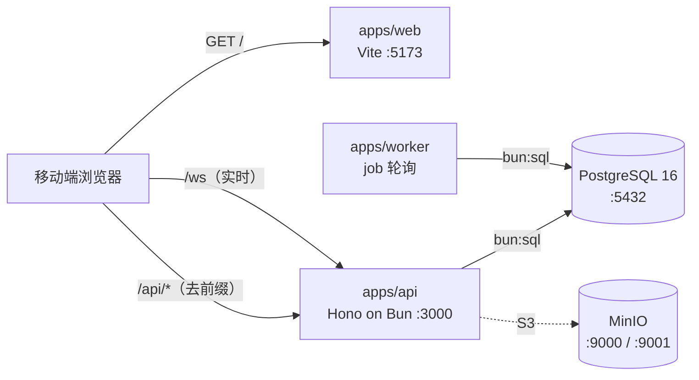

<h1 align="center">
  
  <br />
  FISH · 鱼小应
</h1>

<p align="center">
  <strong>广应科校内二手交易平台 · 移动端 Web</strong><br />
  同校面交 · 让闲置在校园里流动起来
</p>

<p align="center">
  <a href="https://github.com/zzstar101/FISH/actions/workflows/ci.yml"></a>
  
  
  
  
  
  <a href="LICENSE"></a>
  
</p>

---

## 项目简介

FISH（产品名 **鱼小应**）是面向广应科校内的二手交易平台，交互以**手机视口**为基线（设计参考 390×844），桌面端只作兼容。

固定信息架构：

> **首页 / 许愿 / 出物（视觉中心）/ 消息 / 我的**

它不只是「挂闲置」：卖家发布闲置，买家可以**许愿**，服务端用异步 Worker 把两边互相匹配并推送站内通知——**买家不用一直刷，卖家不用猜需求**。交易全程在校内面交，不接平台支付、物流与购物车。

## 核心功能

| 模块 | 能力 |
| --- | --- |
| **校园身份** | 学号即账号（12 位数字）、注册 / 登录（httpOnly 会话 Cookie）、校园认证徽章；未认证用户有明确展示口径 |
| **闲置交易** | 多图发布（presign → 直传到 S3 兼容存储）、首页 Feed、关键词搜索 / 分类 / 排序（最新 · 价格升降）、商品详情与「我想要」 |
| **许愿墙** | 发布与关闭愿望（关键词、分类、预算区间、是否接受相似商品）；「愿望成真」直接展示命中的在售商品；**k-匿名需求池**聚合热门关键词与预算中位数 |
| **双向匹配** | 商品 ↔ 愿望互配：Worker 异步按分类 / 关键词 / 价格加权打分，命中后写匹配表并发站内通知；商品编辑、上下架会重算 |
| **实时聊天** | 会话列表、历史消息、WebSocket 实时推送（心跳 + 指数退避重连）、已读回执；从商品详情「聊一聊」一键建会话 |
| **面交交易** | 提案 → 接受 / 拒绝 → 待面交 → 确认 → 完成 / 取消 的状态机；接单时**原子锁定**商品，防止一物二卖 |
| **个人中心** | 在售 / 愿望 / 买入 / 卖出 四格统计、我的商品、我的订单、他人主页 |
| **站内通知** | 匹配结果通知、未读角标、点击跳转到对应商品 |

> 匹配链路是异步的：**不启动 Worker 就看不到「愿望成真」与匹配通知**，见下方 [快速开始](#快速开始)。

## 技术栈

| 层 | 选型 |
| --- | --- |
| Runtime / 包管理 | **Bun**（`packageManager: bun@1.4.0`，`engines.bun >= 1.4.0`） |
| 前端 | React 19 + Vite + TypeScript |
| 路由 / 服务端状态 | TanStack Router（file-based）+ TanStack Query |
| UI | Tailwind CSS v4 + 自有 `@fish/ui` 组件 |
| 后端 | **Hono on Bun**（`Bun.serve`） |
| 校验 | Zod（Web 与 API 共用 `@fish/contracts`） |
| 数据库 | PostgreSQL 16 + Drizzle ORM（运行时走 `drizzle-orm/bun-sql`） |
| 异步 | PostgreSQL `jobs` 表 + 独立 Bun Worker 轮询 |
| 实时 | Hono / Bun 原生 WebSocket |
| 对象存储 | S3 兼容（本地 MinIO） |
| 质量 | Biome（lint + format）· TypeScript 7（原生 `tsc --noEmit`）· `bun test` · GitHub Actions |

**V1 明确不引入**：Redis、Kafka、OpenSearch、K8s、微服务、平台支付、物流、购物车、结构化报价 / 反价、地图。

## 架构一览

本地开发时 Docker **只托管依赖**（Postgres / MinIO），应用由宿主机 Bun 直接运行。



- Web 一律写相对路径 `/api/...`，开发环境由 Vite 代理去前缀转发到 API；生产同源部署行为一致，无 CORS 与跨域 Cookie 问题。
- 跨包只走 `workspace:*` + `exports` 子路径（无大型 barrel）：

  ```ts
  import { HealthResponseSchema } from '@fish/contracts/system/health'
  import { Button } from '@fish/ui/button'
  import { loadServerEnv } from '@fish/shared/env'
  import { createDb } from '@fish/db/client'
  ```

## 快速开始

前置：**Bun ≥ 1.4** 与 **Docker**（仅用于本地依赖）。

```bash
# 1. 安装依赖
bun install

# 2. 准备环境变量（只需一次；.env 已被 .gitignore 忽略，切勿提交）
cp .env.example .env

# 3. 启动本地依赖：Postgres + MinIO（含 healthcheck 与 bucket 初始化）
bun run db:up

# 4. 建库；可选：灌入演示数据（会先清空业务表）
bun run db:migrate
bun run db:seed
```

分三个终端启动（或 `bun run dev` 一次并行拉起）：

```bash
bun run dev:api      # API    → http://localhost:3000
bun run dev:worker   # Worker（常驻，不监听端口）
bun run dev:web      # Web    → http://localhost:5173
```

打开 <http://localhost:5173> 即可。冒烟自检：

```bash
bun run ws:smoke     # WebSocket 连通性，期望 [ws-smoke] ok
bun run core:smoke   # 核心主链端到端（自建 scratch 库 + 真实 API/Worker/MinIO）
```

## 演示账号（仅本地）

`bun run db:seed` 会写入三个可登录账号，密码统一 `fish123456`（**仅本地演示，禁止用于生产**）：

| 学号 | 昵称 | 校区 | 认证状态 |
| --- | --- | --- | --- |
| `202101000001` | 阿岚 | 肇庆 | 已认证 |
| `202101000002` | 小北 | 肇庆 | 未认证（验证「未认证」展示） |
| `202101000003` | 橙子 | 广州 | 已认证 |

关于 seed 数据，有两点要提前知道：

- seed 为演示商品 `罗技 K380 机械键盘` 投一条 `PENDING` 的 `MATCH_LISTING`，但**不预写匹配结果**；「愿望成真」由 Worker 用真实打分产出（K380 ¥160 ↔ `机械键盘 ≤ ¥200` → 100 分）。**因此要先启动 `bun run dev:worker`**，API 层的 `/matches` 才有数据。
- seed 里商品图的 `object_key` 是占位键（MinIO 中不存在），商品图会 404；真实图片上传链路（presign → PUT → 公开读）由 `bun run core:smoke` 验证。

## 常用命令

| 命令 | 说明 |
| --- | --- |
| `bun run dev` | 并行启动 web / api / worker |
| `bun run dev:web` · `dev:api` · `dev:worker` | 分别启动三个应用 |
| `bun run typecheck` | 全仓 TypeScript 类型检查 |
| `bun run lint` / `bun run format` | Biome 检查 / 格式化 |
| `bun test` | 全仓测试（部分集成测试需要 Postgres 已启动并完成 `db:migrate`） |
| `bun run build` | 构建 |
| `bun run ws:smoke` | WebSocket 连通性冒烟 |
| `bun run core:smoke` | 核心主链端到端冒烟（`-- --runs=5` 可连跑 5 轮） |
| `bun run db:up` / `db:down` | 启动 / 停止本地依赖 |
| `bun run db:generate` / `db:migrate` / `db:studio` | Drizzle 迁移与调试 |
| `bun run db:seed` | 写入演示数据（**会先清空业务表**，仅允许本地数据库） |

### 端口

| 服务 | 端口 |
| --- | --- |
| web | 5173 |
| api | 3000 |
| worker | 不监听端口 |
| MinIO API / Console | 9000 / 9001 |
| PostgreSQL | 5432 |

## 目录结构

```text
FISH/
├─ apps/
│  ├─ web/        React SPA（移动端界面）；Vite dev server 兼作 /api 与 /ws 代理
│  ├─ api/        Hono 应用：HTTP + WebSocket（modules/ 下按 domain 分模块）
│  └─ worker/     常驻进程：轮询 jobs 表执行异步匹配
├─ packages/
│  ├─ db/         Drizzle schema、migration 与 seed
│  ├─ contracts/  前后端共享协议：system/ + 各业务 domain 的 zod schema 与路由常量
│  ├─ ui/         共享 UI 组件
│  └─ shared/     跨包基础能力（环境变量校验等）
├─ docs/          系统文档与设计说明
├─ infra/         部署相关
├─ scripts/       一次性脚本（ws-smoke 等）
└─ docker-compose.yml   本地依赖（Postgres + MinIO）
```

## 当前状态与已知边界

- 后端 domain（auth / listings / wishes / matching / chat / transactions / profile / notifications）与 Worker 异步主链均已交付，前端主链已从 Mock 切到真实 API。
- **站内通知前端列表仍读 fixture**，后端 `GET /notifications*` 已就绪，尚未接线。
- **PWA 安装产物（manifest / Service Worker）尚未接线**，当前为移动优先的 Web 应用。
- 商品搜索当前基于 `ILIKE`；架构文档里规划的 PostgreSQL FTS / `pg_trgm` 未落地。
- 未做的动词：删除商品、删除图片；愿望编辑的 API（`PATCH /wishes/:id`）存在，但契约常量与前端入口未接。

## 文档

| 文档 | 内容 |
| --- | --- |
| [docs/architecture.md](docs/architecture.md) | 系统形态、技术基线、运行时拓扑、HTTP / WebSocket / 异步链路、端口与环境变量 |
| [docs/deployment.md](docs/deployment.md) | 生产部署手册（Ubuntu + Bun 直跑）：依赖、环境变量、systemd、反代与 HTTPS、发布 / 回滚、备份 |
| [CONTRIBUTING.md](CONTRIBUTING.md) | 文件所有权、分支 / 提交 / PR 规范、Contract 流程、DB CHANGE REQUEST |
| [AGENTS.md](AGENTS.md) | 给 AI agent 的操作规程与实现纪律 |
| [docs/README.md](docs/README.md) | 文档索引 |

## License

[MIT](LICENSE) © 2026 zzstar
