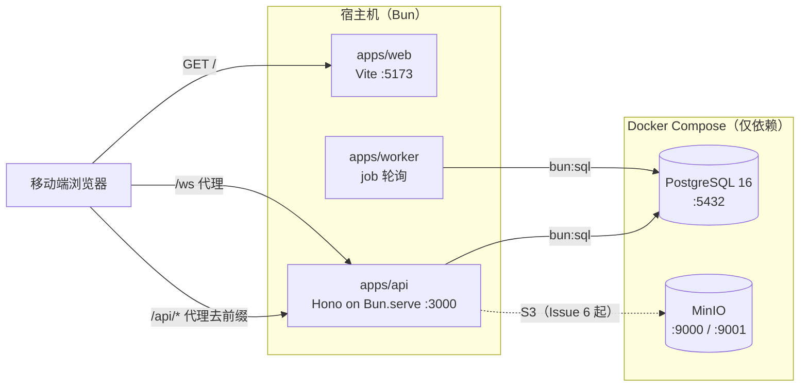
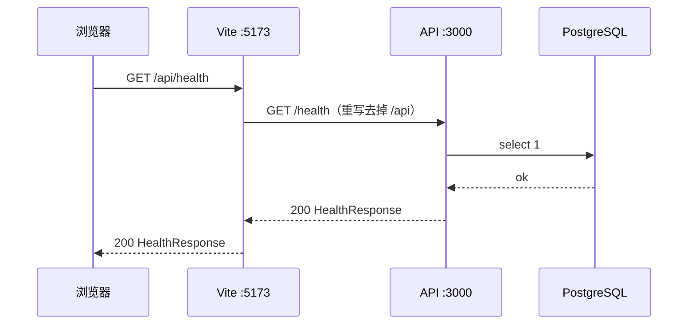
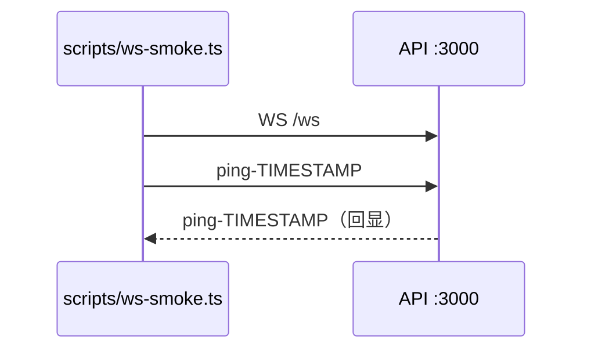
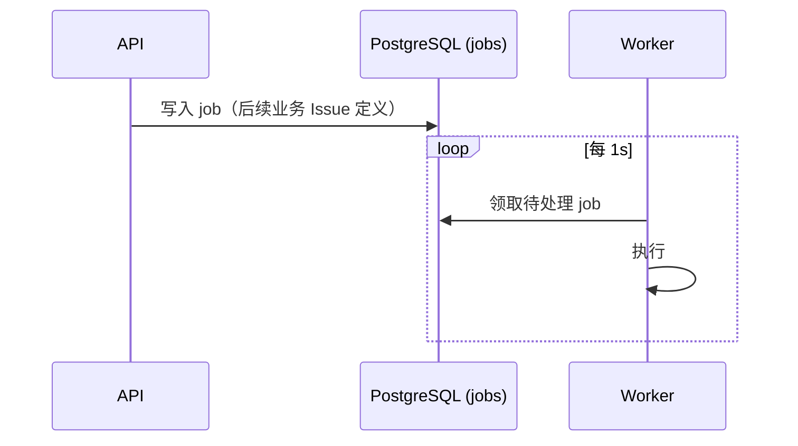

# 架构说明

> 本文描述 **Phase 0 骨架阶段**（issue #1）确立的系统形态与工程约定。
> 业务 Contract 不在本文定义，由对应业务 Issue 产生。

## 1. 系统形态

**移动端 Web PWA**：面向广应科校内的二手交易平台，用户主要在手机上使用。

- 交互基线是**移动端视口**（设计参考 390×844），桌面端只作兼容。
- 产品目标是可安装、可离线的 Web 应用形态；**PWA 的具体实现（manifest / Service Worker / 图标 / 离线策略）由前端 Owner 在 #4 起建立**，#1 不生成任何 PWA 产物。
- 固定信息架构：`首页 / 许愿 / 卖闲置（视觉中心）/ 消息 / 我的`。

## 2. 技术基线

| 层 | 选型 |
| --- | --- |
| Runtime / 包管理 | Bun（`packageManager: bun@1.4.0`，`engines.bun >= 1.4.0`） |
| 前端 | React + Vite + TypeScript |
| 路由 / 服务端状态 | TanStack Router（file-based）+ TanStack Query |
| UI | Tailwind CSS v4（shadcn/ui 由前端 Owner 接入） |
| 后端 | Hono on Bun（`Bun.serve`） |
| 校验 | Zod |
| 数据库 | PostgreSQL 16 + Drizzle ORM（运行时 `drizzle-orm/bun-sql`，走 Bun 内置 `bun:sql`） |
| 异步 | PostgreSQL jobs 表 + 独立 Bun Worker 轮询 |
| 实时 | Hono / Bun 原生 WebSocket |
| 对象存储 | S3 兼容（本地 MinIO） |
| 搜索（V1） | PostgreSQL FTS / `pg_trgm` |
| 代码质量 | Biome（lint + format）· TypeScript 7（原生 `tsc --noEmit`）· `bun test` |

**V1 明确不引入**：Redis、Kafka、OpenSearch、K8s、微服务、平台支付、物流、购物车、结构化报价/反价、复杂推荐与信用、地图、无关 AI Chatbot。

## 3. Monorepo 结构与职责

```text
FISH/
├─ apps/
│  ├─ web/       React SPA（移动端 PWA 壳）；Vite dev server 兼作 /api 与 /ws 代理
│  ├─ api/       Hono 应用；对外 HTTP + WebSocket
│  └─ worker/    常驻进程；轮询 jobs 表执行异步任务
├─ packages/
│  ├─ db/        Drizzle 连接入口（schema 由 #2 建立）
│  ├─ contracts/ 对外协议；system/ 放非业务协议，业务 domain 由各自 Issue 建立
│  ├─ ui/        共享 UI 组件
│  └─ shared/    跨包基础能力（环境变量校验）
├─ docs/         文档
├─ infra/        部署相关
└─ scripts/      一次性脚本
```

包引用一律走 `workspace:*`，并通过 `exports` 的 **subpath** 暴露（不使用大型 barrel `index.ts`）：

```ts
import { HealthResponseSchema } from '@fish/contracts/system/health'
import { Button } from '@fish/ui/button'
import { loadServerEnv } from '@fish/shared/env'
import { createDb } from '@fish/db/client'
```

## 4. 运行时拓扑

本地开发时，Docker **只托管依赖**，应用由宿主机 Bun 直接运行。



## 5. 链路

### 5.1 HTTP 请求

Web 一律写**相对路径** `/api/...`；Vite 在开发时代理到 API 并**去掉 `/api` 前缀**，因此 API 自身路由保持根级（`/health`）。生产同源部署时行为一致，无需 CORS 与跨域 Cookie。



`GET /health` 是**单一端点**，同时反映进程与数据库状态：

- DB 正常 → `200`，`status: "ok"`，`db.status: "up"`
- DB 不可用 → `503`，`status: "degraded"`，`db.status: "down"`

Schema 定义在 `@fish/contracts/system/health`，Web 与 API 共用同一份（这也是"contracts 可被两侧 import"的验证路径）。

### 5.2 WebSocket

`GET /ws` 是**最小 echo 冒烟入口**，仅用于验证连接链路，放在 API 根层。



业务实时能力（会话消息、匹配推送）由 #9 / #8 在 `apps/api/src/modules/realtime` 下建立，届时根路由由 Platform Owner 接线。

### 5.3 异步任务



**Job 表由 #2 建立。** #1 只提供 Worker 的启动入口与轮询骨架：启动时 `select 1` 自检连接，连不上立即失败而不是空转。

## 6. 本地环境

### 端口

| 服务 | 端口 |
| --- | --- |
| web（Vite dev） | 5173 |
| api（Hono / Bun.serve） | 3000 |
| worker | 不监听端口 |
| MinIO API / Console | 9000 / 9001 |
| PostgreSQL | 5432 |

### 环境变量

统一维护在 [`.env.example`](../.env.example)，本地复制为 `.env` 使用：

| 变量 | 用途 |
| --- | --- |
| `DATABASE_URL` | PostgreSQL 连接串 |
| `API_PORT` | API 监听端口 |
| `WEB_ORIGIN` | CORS 白名单 |
| `S3_ENDPOINT` / `S3_REGION` | S3 兼容存储端点与区域 |
| `S3_ACCESS_KEY_ID` / `S3_SECRET_ACCESS_KEY` | 存储凭证（**本地占位值，禁止提交真实密钥**） |
| `S3_BUCKET` / `S3_PUBLIC_URL` | bucket 与公开访问前缀 |

服务端（api / worker）启动时用 `@fish/shared/env` 里的 Zod schema **统一校验**：缺项直接失败，而不是带病运行。

注意：根脚本用 `bun run --filter` 会把工作目录切到各包，因此 api / worker / db 的脚本显式使用 `bun --env-file=../../.env`（Bun 不会向上查找父目录的 `.env`；文件不存在时该参数被静默忽略，CI 不受影响）。

### 一个已知的驱动例外

运行时**只用** Bun 原生 `bun:sql`（`drizzle-orm/bun-sql`），不装 `pg` / `postgres`。

但 **`drizzle-kit` CLI 运行在 Node 上且不支持 `bun:sql`**，它在 `db:generate` / `db:migrate` / `db:studio` 时必须能 `import` 一个 Node Postgres 驱动，否则会报：

```text
To connect to Postgres database - please install either of 'pg', 'postgres', ...
```

因此 `packages/db` 把 **`postgres` 声明为 devDependency**，仅服务于 migration CLI，不进入运行时。这是刻意的例外，不要把它当作冗余依赖删除。

### Docker Compose

`docker compose up -d` 只启动依赖：

- `postgres`：`postgres:16-alpine`，带 `pg_isready` healthcheck
- `minio`：带 `/minio/health/live` healthcheck
- `minio-init`：一次性容器，等 MinIO healthy 后创建 bucket `fish`、并把桶设为**匿名可读**（`mc anonymous set download`，供 #6 的图片直链，见 `packages/contracts` 的 Listing 契约 §7.8），然后退出

## 7. 所有权与 Contract 流程

文件所有权见 [CONTRIBUTING.md](../CONTRIBUTING.md)，并由 [`CODEOWNERS`](../CODEOWNERS) 在 GitHub 层强制。

```text
Issue 确认需求
→ 对应后端 Owner 定义该 Domain Contract
→ 前端确认满足页面需要
→ Contract Freeze
→ 前后端并行实现
```

**`packages/contracts` 在骨架阶段只包含 `system/` 下的非业务协议。** 业务协议随业务 Issue 产生：Listing → #6，Wish → #7，Chat → #9，Transaction → #11。

## 8. 参考：Epic 定义的 P0 主链路

以下链路源自 #15 的产品规划，**不是 #1 定义的 Contract**，仅用于说明各模块的协作关系：

1. 用户 B 创建愿望：`机械键盘 ≤ ¥200`
2. 用户 A 发布：`K380 ¥160`，发布请求立即返回并创建 Match job
3. Worker 产生高匹配 Match，B 收到"愿望成真"
4. B 进入聊天与 A 沟通成交价，B 发起交易确认
5. A 接受后 Listing → `RESERVED`，Transaction → `PENDING_MEETUP`
6. 双方面交并确认完成，Transaction → `COMPLETED`，Listing → `SOLD`
